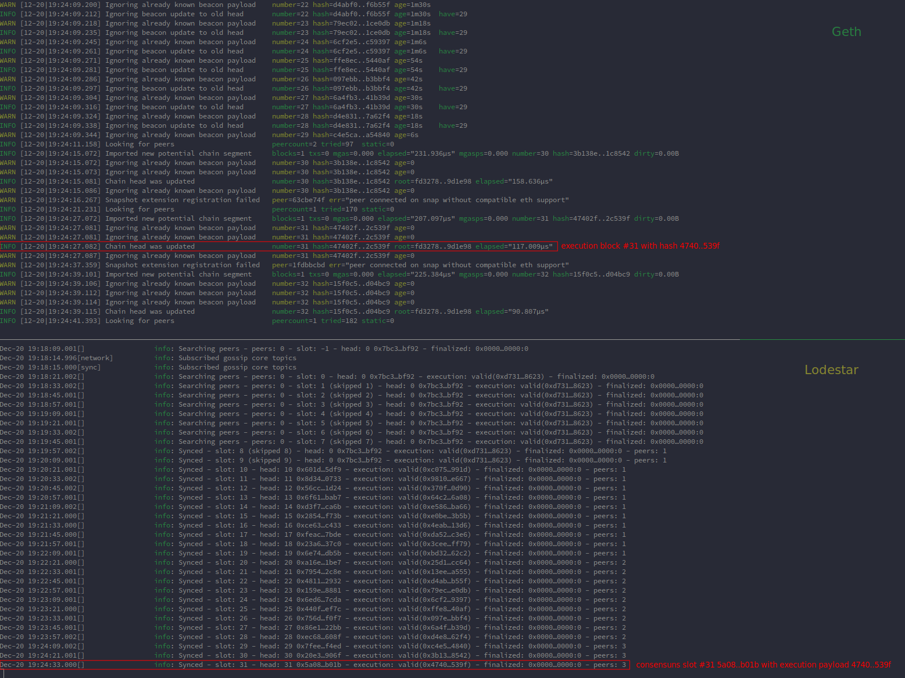

# Post-Merge Ethereum Network

An educational resource:

* [How to merge an Ethereum network right from the genesis block](https://dev.to/q9/how-to-merge-an-ethereum-network-right-from-the-genesis-block-3454)

### Additional Resources

- [github/protolambda/merge-genesis-tools](https://github.com/protolambda/merge-genesis-tools): Testnet tooling to create a merge state at genesis.
- [github/ethereum/consensus-specs](https://github.com/ethereum/consensus-specs): Ethereum proof-of-stake consensus specifications, including mainnet templates and deposit contract.
- [notes/protolambda/merge-devnet-setup-guide](https://notes.ethereum.org/@protolambda/merge-devnet-setup-guide): Multi-client post-merge Ethereum devnet setup by protolambda.
- [github/ethereumjs/consensus-deployment-ansible](https://github.com/ethereumjs/consensus-deployment-ansible): Ansible playbooks by Parithosh that allow us to do everything we did in this tutorial with one click ;)
- [github/protolambda/eth2-testnet-genesis](https://github.com/protolambda/eth2-testnet-genesis): Tool to create a genesis state for an beacon-chain testnet.
- [github/ethereum/staking-deposit-cli](https://github.com/ethereum/staking-deposit-cli): Secure key generation for beacon-chain deposits.
- [github/ethereum/go-ethereum](https://github.com/ethereum/go-ethereum): Official Go implementation of the Ethereum protocol (execution).
- [github/ChainSafe/lodestar](https://github.com/ChainSafe/lodestar): TypeScript implementation of an Ethereum consensus layer.
- [github/eth-clients/holesovice](https://github.com/eth-clients/holesovice): Preview: the first public merged-from-genesis Ethereum testnet.
